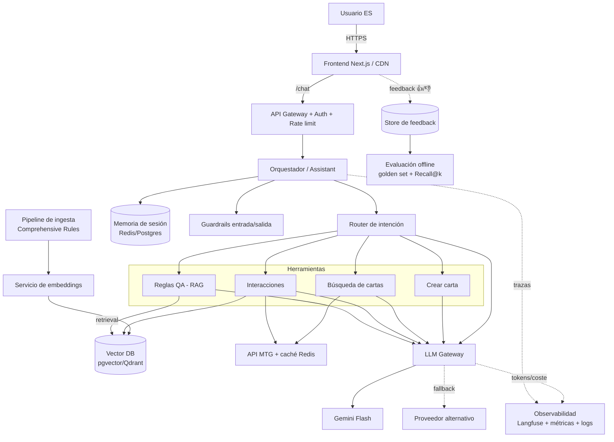

# Arquitectura productiva

Este documento describe cómo evolucionaría el asistente MTG desde la **demo** de este
repo hasta un **servicio en producción** de call center. La demo es deliberadamente
simple (dos procesos, Chroma en disco, caché en fichero); aquí se explica qué cambia,
por qué, y dónde están las costuras que ya dejamos preparadas.

> **Principio rector** (heredado del [DDT](decisions.md)): *trazabilidad > acierto*.
> Cada respuesta cita su fuente (nº de regla / texto de carta). Todo lo demás
> —observabilidad, guardrails, evaluación— se diseña para sostener esa promesa.

---

## 1. De la demo a producción (vista rápida)

| Aspecto | Demo (este repo) | Producción |
|---|---|---|
| Backend | 1 proceso FastAPI | FastAPI tras API gateway, autoescalado (k8s/Cloud Run) |
| Frontend | `next dev` | Next.js en CDN (Vercel/CloudFront) |
| Vector store | Chroma en disco | Vector DB gestionada (pgvector / Qdrant) |
| Embeddings | e5 local en proceso | Servicio de embeddings dedicado (GPU) o API |
| LLM | Gemini directo desde el backend | **LLM Gateway** (routing, fallback, presupuesto) |
| Caché | Ficheros JSON | Redis con TTL |
| Memoria de sesión | Fichero por sesión | Redis/Postgres con TTL + resumen |
| Observabilidad | logs | Tracing LLM (Langfuse) + métricas + alertas |
| Secretos | `.env` | Gestor de secretos (Vault / Secrets Manager) |

Las **abstracciones que ya existen** para que esa migración no toque la lógica:
`get_embedder()` (backend/proveedor de embeddings), `LLMClient` (aísla el SDK de
Gemini), `MTGCardClient` (caché conmutable), `SessionMemory` (almacén conmutable).

---

## 2. Diagrama de producción



*(Si tu visor no renderiza Mermaid, el flujo es: Usuario → Frontend → Gateway →
Orquestador → {Router, Memoria, Guardrails} → Herramienta → {Vector DB, API MTG,
LLM Gateway}. En paralelo: ingesta→embeddings→Vector DB, y trazas/feedback→observabilidad.)*

---

## 3. Servicios y componentes

### 3.1 Frontend (Next.js)
Capa de presentación fina. Renderiza la respuesta según la capacidad (texto + chips de
fuentes, rejilla de cartas, carta custom maquetada). En producción se sirve estático
desde CDN y solo habla con el gateway. Captura **feedback** (👍/👎 + comentario) por turno.

### 3.2 API Gateway
Punto de entrada único: terminación TLS, **autenticación** (API key / OIDC del CRM del
call center), **rate limiting** por agente/sesión, y enrutado al orquestador. Aísla el
backend de internet.

### 3.3 Orquestador (`Assistant`)
Cerebro de la petición. Por cada turno: recupera memoria de sesión → aplica guardrails de
entrada → clasifica intención (router) → ejecuta la herramienta → persiste el turno →
devuelve respuesta **estructurada** (`intent` + `reply` + `sources`/`cards`/`card`). En el
repo es [`backend/assistant.py`](backend/assistant.py); en prod corre stateless detrás de
autoescalado (el estado vive en Redis/Postgres, no en el proceso).

### 3.4 LLM Gateway
Capa que en la demo es `LLMClient` y en prod se promueve a **servicio**:
- **Routing y fallback** entre modelos/proveedores (si Gemini da 5xx/429 sostenido →
  proveedor alternativo) — ya hay reintentos con backoff por error transitorio.
- **Control de presupuesto**: límites de tokens/coste por tenant, *kill switch*.
- **Caché semántica** opcional de respuestas frecuentes.
- Punto único donde medir **tokens, latencia y coste**.

### 3.5 Datos y RAG
- **Pipeline de ingesta** ([`backend/ingest.py`](backend/ingest.py)): parsea las
  *Comprehensive Rules*, **chunkea por nº de regla** (unidad citable), filtra cabeceras
  ruidosas, e indexa con `store_id` estable → **reingesta idempotente**. En prod se dispara
  por versión del reglamento (publican actualizaciones); versionado del índice + reindex sin
  downtime (blue/green del corpus).
- **Embeddings**: e5 multilingüe (cross-lingual ES↔EN). En prod, servicio dedicado
  (batch en GPU) o API; conmutable vía `get_embedder()` / `EMBED_BACKEND`.
- **Vector DB**: Chroma local → pgvector o Qdrant gestionado (HA, snapshots, filtros por
  metadato `type`/`section`).
- **API de cartas**: `magicthegathering.io` con **caché** (fichero → Redis con TTL) y
  **backoff** ante 429/5xx. En prod conviene además un *mirror* periódico para no depender
  de la disponibilidad del tercero en caliente.

---

## 4. El asistente como sistema de agentes

El enunciado pide "agentes". Aquí el patrón es **router + herramientas especializadas**
(más fiable y barato que un agente ReAct de bucle abierto para un dominio acotado):

| Agente / herramienta | Técnica | Fuente que cita |
|---|---|---|
| **Router** | clasificación (LLM + fallback heurístico determinista) | — |
| **Reglas QA** | RAG sobre Comprehensive Rules | nº de regla |
| **Interacciones** | lookup de cartas (API) + RAG de reglas + razonamiento | regla + carta |
| **Búsqueda** | *function calling* → query estructurada a la API | cartas devueltas |
| **Crear carta** (bonus) | salida JSON estructurada con schema fijo | — (generativo) |

**Por qué router y no un único agente autónomo**: dominio cerrado y 4 intenciones bien
definidas. Un router es **predecible, testeable y barato** (1 clasificación + 1 herramienta
vs. múltiples vueltas de razonamiento). El fallback heurístico garantiza respuesta aunque el
LLM falle. Si el catálogo de capacidades creciera mucho, se evolucionaría a un planner/agente
con las mismas herramientas como *tools*.

---

## 5. Observabilidad

Sin observabilidad no hay forma de defender "trazabilidad" en producción.

- **Tracing de LLM** (Langfuse / LangSmith): cada turno deja una traza con la pregunta,
  la intención clasificada, los **chunks recuperados con su score**, el prompt final, la
  respuesta y las fuentes citadas. Esto permite reproducir *por qué* el sistema dijo lo que
  dijo — es el equivalente a "ver el grounding".
- **Métricas** (Prometheus/OpenTelemetry): latencia p50/p95 por capacidad, tasa de error,
  **tokens y coste por intención**, hit-rate de cachés, distribución de intenciones,
  Recall@k del retriever en producción (con el golden set).
- **Logs estructurados** con `session_id`/`trace_id` correlables.
- **Alertas**: pico de 429/5xx del LLM o de la API MTG, caída de Recall@k, subida de coste,
  ratio de "no encontré contexto suficiente" (señal de hueco en el corpus o mal retrieval).

---

## 6. Guardrails y seguridad

- **Prompt injection**: el contexto recuperado se inserta **como DATOS, nunca como
  instrucciones** (`<context>` + system prompt que lo explicita). Ya implementado en los
  prompts (ver `code_review.md` S2). El corpus es de confianza, pero el texto de cartas
  comunitarias no necesariamente.
- **Grounding obligatorio**: si el contexto no basta, el prompt obliga a decir "no tengo
  información suficiente" en vez de inventar. Reduce alucinaciones en un call center.
- **Guardrail de entrada**: filtro de off-topic / abuso antes de gastar LLM.
- **Guardrail de salida**: validación de esquema (la carta custom se valida con pydantic;
  los filtros de búsqueda neutralizan valores centinela del LLM). Opcional: verificación de
  que toda afirmación citada referencia una fuente realmente recuperada.
- **Secretos**: API keys fuera del repo (`.env` gitignoreado → gestor de secretos en prod).
- **PII**: las conversaciones de call center pueden contener datos personales → cifrado en
  reposo, TTL de retención y anonimización en las trazas.

---

## 7. Feedback loop y mejora continua

```
Usuario 👍/👎 ─▶ Store de feedback ─▶ Triage ─▶ {ampliar corpus, ajustar prompts,
                                                  añadir caso al golden set}
                                          │
                          Evaluación offline (golden set + Recall@k) en CI
                                          │
                                  Promoción del cambio
```

- **Feedback explícito** (pulgar arriba/abajo por turno) e **implícito** (reformulaciones,
  escalado a agente humano).
- **Conjunto dorado** (`golden_questions.yaml`): preguntas → regla/carta esperada. Mide
  **Recall@k** del retriever y la calidad de las respuestas. Se ejecuta en CI: un cambio de
  modelo de embeddings, de chunking o de prompt **no se promociona si baja el Recall@k**.
- **Evaluación de generación**: *LLM-as-a-judge* sobre groundedness (¿la respuesta se apoya
  solo en el contexto citado?) y fidelidad de las citas.
- Los fallos reportados se convierten en nuevos casos del golden set → el sistema mejora de
  forma medible, no por intuición.

---

## 8. Caché, rendimiento y fiabilidad

- **Cachés**: respuestas de la API MTG (TTL largo, cambian poco), caché semántica de
  preguntas frecuentes en el LLM Gateway, y los embeddings del corpus se calculan una vez.
- **Backoff con jitter** ante 429/5xx (LLM y API MTG); solo se reintentan errores
  **transitorios**, nunca 4xx de cliente.
- **Degradación elegante**: si el LLM clasificador cae → heurística; si la API de cartas cae
  → se responde con las reglas recuperadas; si el vector store cae → mensaje honesto en vez
  de inventar.
- **Stateless + autoescalado**: el backend no guarda estado en memoria, así que escala
  horizontalmente; el estado vive en Redis/Postgres/Vector DB.

---

## 9. CI/CD y despliegue

- **CI** (GitHub Actions): `pytest` (unit + retrieval determinista), `ruff`/`mypy`,
  `next build` del frontend, y **evaluación del golden set** como gate de calidad.
- **Build**: imágenes Docker del backend; el frontend se despliega en CDN.
- **Entornos**: dev → staging → prod, con el **índice vectorial versionado** y reindexado
  blue/green al publicarse una nueva versión del reglamento.
- **Secretos** inyectados por el entorno, nunca en la imagen.
- **Rollback**: versiones de prompt e índice etiquetadas; revertir = reapuntar a la etiqueta
  anterior.

---

## 10. Resumen de costes

- **Embeddings**: coste cero (local) en demo; en prod, batch en GPU una vez por versión del
  reglamento (no por consulta).
- **LLM**: principal coste variable → controlado en el **gateway** (presupuesto por tenant,
  caché semántica, modelo Flash por defecto y escalado a un modelo mayor solo si hace falta).
- **API MTG**: gratuita + caché → coste marginal nulo.
- **Infra**: vector DB gestionada + Redis + cómputo del backend; dominan el coste fijo.
